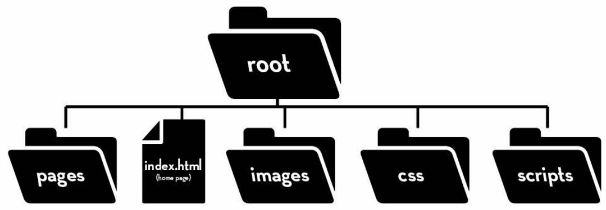

# CHC4010 DevOps Week 1- Exercises Using the Command Line
  
1. Download images.zip, and unzip it into your home directory.
2. Open the terminal or Windows Powershell. All the following exercises should be done with command line only.
3. Find out the folder structure of images directory and represent it using a tree diagram. Don’t forget about the hidden folders and files!
  
Example:
  

  
4. In your home directory, make a copy of images folder called images_by_type. In images_by_type folder, move all files out of their subfolder and place them directly under images_by_type folder. Remove all the subfolders. Tips: cp alone cannot copy a folder and all its content. You might need to use some switches or options.
5. Create a file called image_list.txt in images_by_type. Write the content list of images_by_type into this text file.
6. In images_by_type folder, create three subfolders, jpeg, png, and gif. Move all pictures in images folder into the three subfolders we just created, based on their format. For example, swimming.gif should go to gif folder.
Tips: using wildcards could make this a lot easier!

> [!TIP]
> 🔗 [Solution](week-1-lecture-exercise-solution.md)
