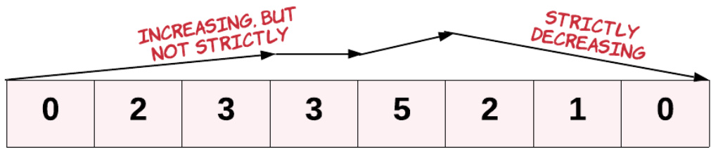

# CHC4010 DevOps Week 2 – Practical: Testing  

## Exercise 1: Testing from a specification  

Determine a set of Black Box test cases and test data from the following specification.  
Given an array of integers `arr`, return true if and only if it is a valid mountain array. That `arr` is a mountain array if and only if:  
- `arr.length`  > = 3   
- There exists some i with $0 < \dot { 1 } < arr.length - 1$ such that: 
    - $$arr[0] \textless arr[1] < ... < arr[i - 1] < arr[i]$$
    - $$arr[i] > arr[i+1] > ... > arr[arr.length - 1]$$  
  

<html><body><table align=center><tr><td>0</td><td>2</td><td>3</td><td>4</td><td>5</td><td>2</td><td>1</td><td>0</td></tr></table></body></html>  
<html><p align=center>MOUNTAIN ARRAY</p></html>  
  
<html><p align=center>NOT A MOUNTAIN ARRAY</p></html>    

Example:  

<html><body><table><tr><td>Test case</td><td>Test data</td><td>Expected result</td></tr><tr><td>An array that ascends. without descending</td><td>[-9, 0, 2, 5, 19]</td><td>False</td></tr><tr><td>An array that descends without ascending</td><td>[28, 15, 12, 5, -3, -4]</td><td>False</td></tr><tr><td>A valid mountain array</td><td>[0, 2, 3, 4, 5, 2, 1, 0]</td><td>True</td></tr></table></body></html>  

### Test cases:  

1. Arrays of lengths 0 and 1 e.g. `[], [1]`   
2. Arrays of length 2, ascending, descending and plateauing e.g. `[1, 2], [2, 1], [1, 1]`   
3. An array that ascends without ever descending e.g. `[1, 2, 3, 4, 5]`   
4. An array that descends without ever ascending e.g. `[5, 4, 3, 2, 1]`   
5. A valley array (descends first then ascends) e.g. `[3, 2, 1, 2, 3]`   
6. An array that ascends, plateaus, ascends again, and   
descends e.g. `[1, 2, 2, 3, 4, 3]`   
7. An array that ascends, plateaus, and descends e.g. `[1, 2, 2, 1]`   
8. An array that ascends, descends, plateaus, and descends   
again e.g. `[1, 3, 2, 2, 1]`   
9. An array that plateaus, then descends e.g. `[2, 2, 1]`   
10. An array that ascends, then plateaus e.g. `[1, 2, 2]`   
11. An array that plateaus, then ascends e.g. `[2, 2, 3]`   
12. An array that descends, then plateaus e.g. `[2, 1, 1]`   
13. An array that ascends, descends, then ascends again e.g. `[1, 2, 3, 2, 4]`   
14. An array that descends, ascends, then descends again e.g. `[3, 1, 2, 1]`   
15. A valid mountain array of length 3 e.g. `[1, 2, 1]`   
16. A mountain array that begins to descend towards the   
beginning e.g. `[1, 3, 2, 1]`   
17. A mountain array that begins to descend towards the end e.g. `[1, 2, 3, 1]`   
18. A mountain array that begins to descend around the midd e.g. `[1, 2, 3, 2, 1]`  


## Exercise 2: Test an implementation  

Using your test plan walk through the algorithm below with the tests above.  
```python
def validMountainArray(arr: list[int]) -> bool:
    ascending = True
    i = 1
    while ascending and i < len(arr):
        ascending = arr[i] > arr[i - 1]
        i += 1
    if i == len(arr):
        return False
    descending = True
    while descending and i < len(arr):
        descending = arr[i] < arr[i - 1]
        i += 1
    return i == len(arr)
```

<html><body><table><tr><td>Test Case</td><td>Test Data</td><td>Expected Output</td><td>Actual Output</td><td>Correct?</td></tr><tr><td>Arrays of lengths 0 and 1</td><td>[],[1]</td><td>False</td><td>False</td><td></td></tr><tr><td>Arrays of length 2, various</td><td>[1, 2],[2, 1], [1, 1]</td><td>False</td><td>False</td><td></td></tr><tr><td>Ascends without descending</td><td>[1, 2, 3, 4, 5]</td><td>False</td><td>False</td><td></td></tr><tr><td>Descends without ascending</td><td>[5, 4, 3, 2, 1]</td><td>False</td><td>True</td><td>×</td></tr><tr><td>Valley array</td><td>[3, 2, 1, 2, 3]</td><td>False</td><td>False</td><td></td></tr><tr><td>Ascends, plateaus, ascends, descends</td><td>[1, 2, 2, 3, 4, 3]</td><td>False</td><td>False</td><td></td></tr><tr><td>Ascends, plateaus, descends</td><td>[1, 2, 2, 1]</td><td>False</td><td>True</td><td>×</td></tr><tr><td>Ascends, descends, plateaus, descends</td><td>[1, 3, 2, 2, 1]</td><td>False</td><td>False</td><td></td></tr><tr><td>Plateaus, then descends</td><td>[2, 2, 1]</td><td>False</td><td>True</td><td>×</td></tr><tr><td>Ascends, then plateaus</td><td>[1, 2, 2]</td><td>False</td><td>False</td><td></td></tr><tr><td>Plateaus, then ascends</td><td>[2, 2, 3]</td><td>False</td><td>True</td><td>×</td></tr><tr><td>Descends, then plateaus</td><td>[2, 1, 1]</td><td>False</td><td>True</td><td>×</td></tr><tr><td>Ascends, descends, then ascends </td><td>[1, 2, 3, 2, 4]</td><td>False</td><td>True</td><td>×</td></tr><tr><td>Descends, ascends, then descends</td><td>[3, 1, 2, 1]</td><td>False</td><td>False</td><td></td></tr><tr><td>Valid mountain of length 3 Mountain descends towards</td><td>[1,2, 1]</td><td>True</td><td>False</td><td>×</td></tr><tr><td>beginning</td><td>[1, 3, 2, 1]</td><td>True</td><td>True</td><td></td></tr><tr><td>Mountain descends towards end</td><td>[1, 2, 3, 1]</td><td>True</td><td>False</td><td>×</td></tr><tr><td>Mountain descends around middle</td><td>[1, 2, 3, 2, 1]</td><td>True</td><td>True</td><td></td></tr></table></body></html>  


## Exercise 3: Fix the implementation  

Did the implementation above pass all your tests? If not, can you find and fix the bugs?  
Correct implementation:  
```python
def validMountainArray(arr: list[int]) -> bool:
    i = 0
    while i < len(arr) - 1 and arr[i] < arr[i + 1]:
        i += 1
    if i <= 0 or i >= len(arr) - 1:
        return False
    while i < len(arr) - 1 and arr[i] > arr[i + 1]:
        i += 1
    return i >= len(arr) - 1
```

## Exercise 4: Automate your tests (optional)  

Can you write a method that will test the algorithm with all of your test data, so that you don’t have to do so manually? Your method should print out all the test cases that failed and output a Boolean indicating the final result.  
```python
def validMountainArray(arr: list[int]) -> bool:
    ascending = True
    i = 1
    while ascending and i < len(arr):
        ascending = arr[i] > arr[i - 1]
        i += 1
    if i == len(arr):
        return False
    descending = True
    while descending and i < len(arr):
        descending = arr[i] < arr[i - 1]
        i += 1
    return i == len(arr)

test_cases = [
    ([], False),
    ([1], False),
    ([1, 2], False),
    ([2, 1], False),
    ([1, 1], False),
    ([1, 2, 3, 4, 5], False),
    ([5, 4, 3, 2, 1], False),
    ([3, 2, 1, 2, 3], False),
    ([1, 2, 2, 3, 4, 3], False),
    ([1, 2, 2, 1], False),
    ([1, 3, 2, 2, 1], False),
    ([2, 2, 1], False),
    ([1, 2, 2], False),
    ([2, 2, 3], False),
    ([2, 1, 1], False),
    ([1, 2, 3, 2, 4], False),
    ([3, 1, 2, 1], False),
    ([1, 2, 1], True),
    ([1, 3, 2, 1], True)
    ([1, 2, 3, 1], True)
    ([1, 2, 3, 2, 1], True),
]

for case in test_cases:
    assert(validMountainArray(case[0]) == case[1], f"should return {case[1]} for {case[0]}")
```
