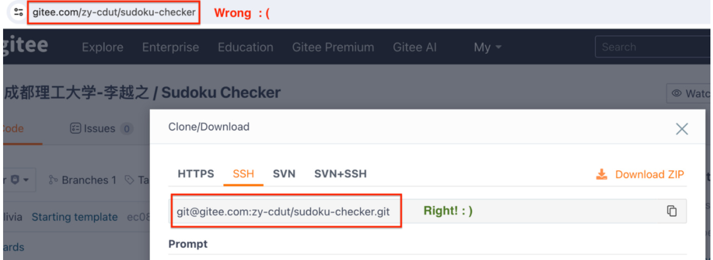
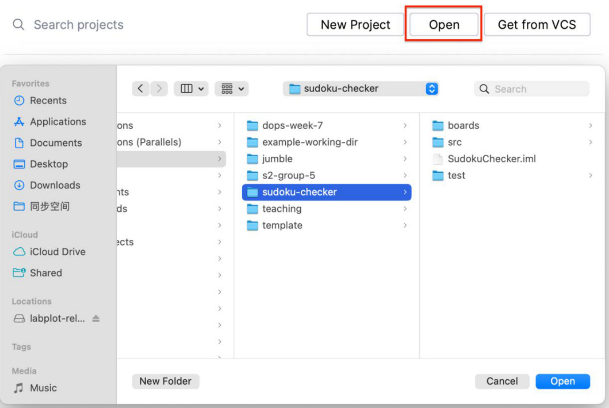
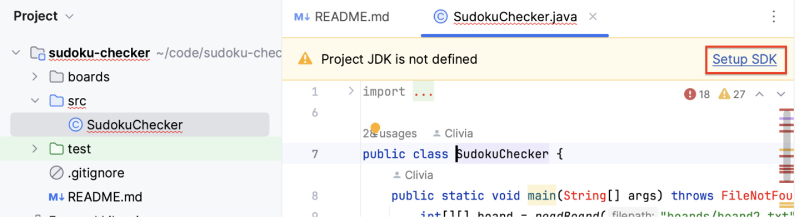
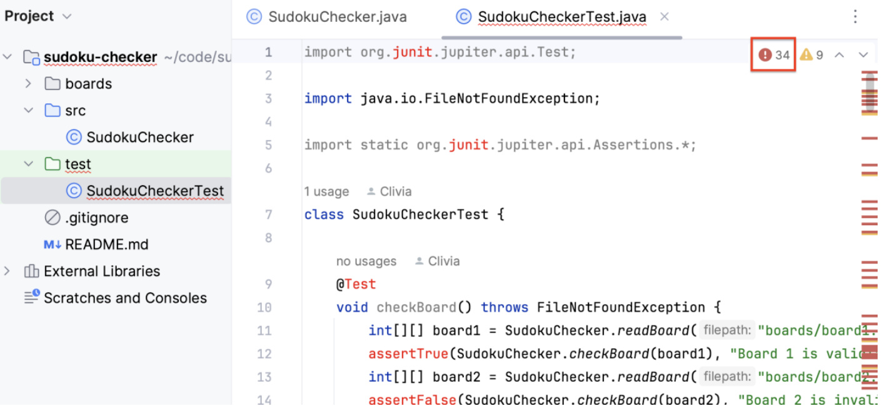
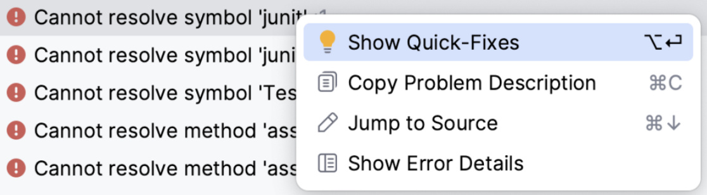
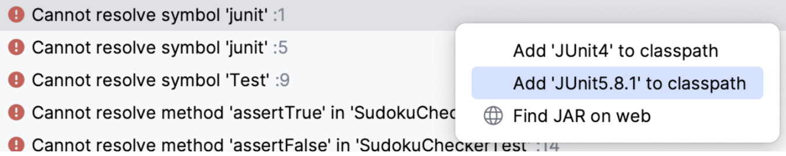
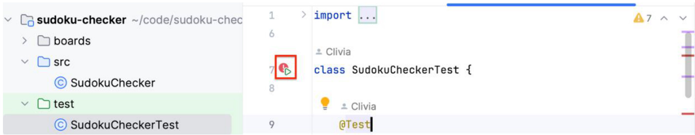

# CHC4010 DevOps – Version Control Practice  

For this lecture, you will be using Git to collaborate on a software project.  

You have been provided with a partially implemented java program that validates solutions to the well‐known game of “Sudoku”.  

To work on this project, you need to:  

1. Have Git installed on your computer 
2. Have an account on Gitee 
3. Have joined the educational organization on Gitee 
4. Have added your SSH public key to Gitee 
5. Have IntelliJ and a working JDK installed  

Please contact your instructor if you have difficulty with any of the above items.  

## Sudoku  

The Sudoku board is made up of 9 rows, 9 columns, and $9 3 \times 3$ boxes. Each number from 1 to 9 must appear in every row, every column, and every box exactly once.  

The program will read a matrix of numbers from a file and verify whether it’s a correct Sudoku solution or not. If the solution is valid, which means every row, column and box have every number from 1 to 9 appearing only once, then a message will display that the solution is valid. Otherwise, a message will display which row, column or box is invalid.  

Example of a valid solution:  

<html><body><table><tr><td>3</td><td>7</td><td>6</td><td>8</td><td>2</td><td>9</td><td>4</td><td>5</td><td>1</td></tr><tr><td>2</td><td>5</td><td>4</td><td>3</td><td>6</td><td>1</td><td>9</td><td>7</td><td>8</td></tr><tr><td>9</td><td>1</td><td>8</td><td>4</td><td>5</td><td>7</td><td>6</td><td>3</td><td>2</td></tr><tr><td>7</td><td>4</td><td>3</td><td>6</td><td>8</td><td>5</td><td>1</td><td>2</td><td>9</td></tr><tr><td>6</td><td>8</td><td>5</td><td>9</td><td>1</td><td>2</td><td>7</td><td>4</td><td>3</td></tr><tr><td>1</td><td>2</td><td>9</td><td>7</td><td>3</td><td>4</td><td>5</td><td>8</td><td>6</td></tr><tr><td>8</td><td>9</td><td>1</td><td>5</td><td>7</td><td>3</td><td>2</td><td>6</td><td>4</td></tr><tr><td>5</td><td>3</td><td>2</td><td>1</td><td>4</td><td>6</td><td>8</td><td>9</td><td>7</td></tr><tr><td>4</td><td>6</td><td>7</td><td>2</td><td>9</td><td>8</td><td>3</td><td>1</td><td>5</td></tr></table></body></html>  

Example of an invalid solution:  

<html><body><table><tr><td>3</td><td>5</td><td>8</td><td>6</td><td>4</td><td>1</td><td>7</td><td>2</td><td>9</td></tr><tr><td>7</td><td>4</td><td>1</td><td>9</td><td>2</td><td>3</td><td>5</td><td>6</td><td>8</td></tr><tr><td>6</td><td>2</td><td>9</td><td>8</td><td>7</td><td>5</td><td>3</td><td>1</td><td>4</td></tr><tr><td>4</td><td>9</td><td>3</td><td>5</td><td>1</td><td>8</td><td>2</td><td>7</td><td>6</td></tr><tr><td>8</td><td>6</td><td>7</td><td>4</td><td>3</td><td>2</td><td>1</td><td>9</td><td>5</td></tr><tr><td> 5</td><td>1</td><td>2</td><td>7</td><td>9</td><td>6</td><td>8</td><td>4</td><td>3</td></tr><tr><td>2</td><td>3</td><td>6</td><td>1</td><td>5</td><td>9</td><td>4</td><td>8</td><td>7</td></tr><tr><td>9</td><td>7</td><td>5</td><td>2</td><td>1</td><td>4</td><td>6</td><td>3</td><td>8</td></tr><tr><td>1</td><td>8</td><td>4</td><td>3</td><td>6</td><td>7</td><td>9</td><td>5</td><td>2</td></tr></table></body></html>  

Try one for yourself!  

<html><body><table><tr><td></td><td></td><td>4</td><td></td><td>8</td><td></td><td>1</td><td>3</td><td></td></tr><tr><td>2</td><td></td><td></td><td></td><td>9</td><td>5</td><td></td><td></td><td></td></tr><tr><td></td><td></td><td>1</td><td></td><td>6</td><td></td><td>7</td><td>5</td><td></td></tr><tr><td></td><td></td><td></td><td>5</td><td></td><td></td><td>8</td><td>7</td><td></td></tr><tr><td></td><td></td><td>6</td><td></td><td></td><td>9</td><td></td><td></td><td></td></tr><tr><td>4</td><td>3</td><td></td><td></td><td></td><td></td><td></td><td></td><td></td></tr><tr><td></td><td></td><td></td><td></td><td></td><td></td><td></td><td>4</td><td></td></tr><tr><td></td><td></td><td></td><td>7</td><td></td><td></td><td></td><td>6</td><td></td></tr><tr><td></td><td>1</td><td>2</td><td></td><td>5</td><td></td><td></td><td></td><td></td></tr></table></body></html>  

## Setting Up the Project  

Open Git Bash/Terminal and choose a location for the working directory. It should be a location that you can easily find.  

Clone the remote repository to this location (`git clone <remote_repo_url>`) then cd into the project directory.  

Where to find the correct url:  

  

Next, launch IntelliJ and open the project from the directory we have cloned:  

  

You need to manually set up SDK:  

  

And add `Junit 5` to class Path:  

  

 SudokuCheckerTest.java \~/code/sudoku-checker/test 43 problems  

  

 SudokuCheckerTest.java \~/code/sudoku-checker/test 43 problems  

  

After finishing these steps, run the test suite to make sure that the project is properly set up.  

  

All the tests will fail, but that’s okay. It’s because the methods are not yet implemented.  

## Working on the Project  

Before starting on any task, everyone in the group should add their name to “Group Members” on the printout “Group Task Table”.  

There are 8 tasks of varying levels of difficulty. In the file `SudokuChecker.java`, you will find comments that link a method to a certain task, such as:  

```java
public static int[][] readBoard(String filepath) throws FileNotFoundException {
    FileInputStream fileInputStream = new FileInputStream(filepath);
    Scanner scanner = new Scanner(fileInputStream);
    int[][] board = new int[9][9];
    // Task 1: read the integers with scanner and save them into the array board
    scanner.close();
    return board;
}
```

If you decide to take on a task, write your name in the “implemented by” cell.  

If task x depends on task y, then task x cannot be started until task y is completed and merged. Otherwise, the tasks can be worked on simultaneously by different developers.  

<a name="necessary-steps"></a>
## Before you start working on a task, remember to  

1. switch to master branch (`git switch master`) and get the newest code on master (`git pull origin master`);   
2. create a new branch (`git branch <branch_name>`) and switch to that branch (`git switch <branch_name>`).   
<ins><strong>Don’t commit directly on master branch!</strong></ins> Code will be merged to master only after they have been peer reviewed.  

If you find yourself getting stuck on a task for more than 10 minutes, don’t hesitate to ask for help from your teammates or from the teacher.  

Read the Javadoc and comments to understand the task you have taken on. If you’re still unclear about what a certain method is supposed to do after reading its Javadoc, go to test/SudokuCheckerTest.java and read the testing code for this method. It might give you some clues. The test for the method should pass if you have implemented it correctly.  

After finishing a task, you need to  

1. run the corresponding test in `SudokuCheckerTest.java` and make sure it passes;   
2. check the “finished” box in “Group Task Table”;   
3. add your changes to staging (`git add .`) and make a commit (`git commit -m “<commit_message>”`);   
4. push your branch to the remote repository (`git push origin <branch_name>`);   
5. create a pull request with your branch on Gitee;   
6. choose a teammate to review your pull request; write their name in the “reviewed by” cell in “Group Task Table” and send them the link to your pull request;   
7. after your teammate has merged the pull request, check the “merged” in “Group Task Table”.  

A task is not done until the code has been merged to master branch! Before you start on the next task, don’t forget about the [necessary steps](#necessary-steps)!  

When you’re requested by a teammate to review their pull request, take a close look at the changes and give feedback as you see fit. If there are bugs or flaws, point them out in the comment and ask your teammate to fix the code; if everything is good, give them a big thumbup and merge the pull request. Don’t forget to check the “merged” box for the corresponding task in “Group Task Table”!  

Here is a little introduction to [2D arrays](https://www.programiz.com/java-programming/multidimensional-array), to help you with code writing.  
