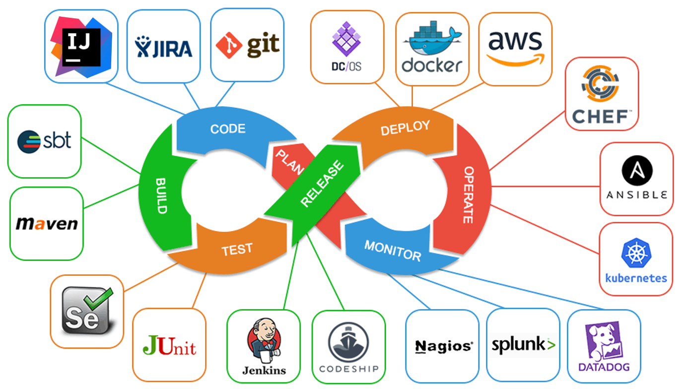

# Week 1 Introduction & Command Line

## Defination

**DevOps**:
- Development
    - The part of a company that **creates new software**.
    - Carries out requirements analysis, design, software engineering, and programming.
    - Tests the produced software and then hands it over to the customer for installation.
    - Responds to customer requests and bugs with large patches, usually delivered relatively slowly. 
    
- Operations
    - The part of a company that manages computers at the backend, eg servers and shared storage.
    - May or may not be the same as **customer support** which addresses end user queries or **IT support** which addresses internal user queries and computers.
    - Installs server based software and possibly internal user software and keeps it running.
    - Maintains computers based on immediate performance and responses. Responds to requests with small fixes delivered ASAP.
    - Ideally, proactively monitors and maintainss systems to guard against future failure.
    
> [!TIP]    
> Better take a look at [DevOps](https://en.wikipedia.org/wiki/DevOps) in Wikipedia for deep understanding.

**DevOps**:
- A combination of the techniques and disciplines involved in both development and operations, used to *enhance the software development and maintenance process*.
- **Not** an abbreviation of "development operations" as in the development kind of operations. Better read as "development/operations".
- Techniques from operations are applied to development to see the software as a continuously maintained system. Often tied into the idea of "software as a service" (SaaS)

DevOps does not have a single definition. Used in a number of contexts by different groups, but the general theme is always similar: combining aspects from the discipline of operations with those of development.

This module will look at operations skills and how they are integrated with development. This includes how to use tools to:
- Make it easier to write code
- Find and fix bugs
- Test programs automatically
- Work with other developers
- Create different versions of a program
- Monitor how well a program works
- Make changes rapidly available to users

## Toolchains
- A concept used in DevOps and elsewhere: rather than single tools, work is done using tool chains of multiple programs that work together with each other
- The most basic toolchains used in programming are those surrounding the compiler or interpreter that enables the program to run or be run
- DevOps introduces further tools to the system, for:
    - Automated testing (code that checks other code)
    - Source Control and Continuous Integration (enabling multiple programmers to work together)
    - Configuration Management and Deployment (setting up multiple versions of software and preparing it for users)
    - Monitoring and Maintenance or Continuous Deployment (detecting problems and rapidly providing fixes to users)

Toolchain example



## Programming Languages

- Interpreted 
- Compiled  

### Interpreted Languages

```
Process:
Source Code -> Interpreter -> Program Runs
```

- **Source code** is the code you write, in Python or another programming language
- Source code is human readable and relatively easy to understand
- The **Interpreter** reads in the source code, processes it to understand it (**parses** it), and follows the instructions one by one
- This causes the program to run
- **Python** is an interpreted language
- Many languages used on web servers are also interpreted, such as *PHP*, *Ruby* and *Perl*

Benefits of Interpreted Languages:

- **Easy for the developer**
    - Changed source code can be run right away
    - REPL (Console) can be provided to experiment
    - Errors isolated in human readable commands
- **Works on different computers**
    - Python interpreter is different for different computers
    - But program written in Python gives the same results when run by any Python interpreter
    - Interpreter can run commands differently to be as efficient as possible on the particular computer
- **Can be safer and more secure**
    - Interpreter can monitor behavior of program
    - Can refuse to follow commands that would cause damage or do things the user does not want
    - This is the primary reason why interpreted languages are used on web servers

Problems with Interpreted Languages:

- **Interpretation Overhead**
    - Parsing the source code takes CPU time and memory
    - Since this is done constantly, the program will run more slowly and consume more resources that it would need otherwise
- **Difficult to Deploy**
    - Deployment is giving the program to other people to use
    - Must give them the human readable source code, allowing them to change the program
    - Must also give them the interpreter program, which may be large and hard for a user to understand, or in some cases may be copyrighted

### Compiled Languages

```
Process:
Source Code -> Compiler -> Native Executable -> Loader or Operating System -> Run Programs
```

- **Source code** is the code you write as before
- The **Compiler** reads in the source code, processes it to understand it (parses it), but does not follow the instructions right away
- Instead it converts them into the **machine code** of the computer
- The machine code, plus other information on the program, is packed into a **native executable** file
- The computer’s operating system will load and run native executable files directly by loading in the machine code and telling the processor to run it; the other information in the file helps the OS work out what memory the program needs, how to share the CPU with other programs, etc.
- If a computer has no operating system (usually an embedded system) it will need a **loader** which does nothing but read in the machine code and start it

Benefit of Compiled Languages:

- **No extra overhead**
    - Running program is in machine code
    - Can run directly on CPU with no middle steps required
- **Safe deployment**
    - Can give others just the native executable
    - Machine code is difficult to understand or change, and no extra software (apart from OS) is needed
- **Lowest level access**
    - Ultimately everything that runs on the CPU is in machine code
    - Compiled languages can offer much greater control over the exact machine code generated

Problems with Compiled Languages:

- **Harder for the developer**
    - Changed source code must be recompiled before being run – may be slow
    - Finding an error requires identifying the part of the source code which generated the machine code which had the error – this requires adding extra data to the executable and can still be difficult
- **Works on limited range of computers**
    - Native executable is specific to a particular machine code and operating system
- **Can be less safe**
    - Program runs directly on CPU with no supervision
    - Can crash the computer, delete data, steal data
    - Some CPUs and OSes support applying some restrictions to machine code programs, especially for memory access, but still relatively limited

Example Compiled Languages：

- **C++** is the best known compiled language
- Usually used where **high performance** or **low-level access** is critical
- Commonly used for games, embedded systems, and simpler mobile systems (not iOS or Android)
- May also be used for **parts** of a program where speed is critical
- Since ultimately every program must be in machine code, all other paths use compilation at some point: *an interpreter program must itself be written and compiled*
- Operating systems must be compiled since there is no lower level program running to support them (exception: Android is generally considered an OS although it is usually a program running under Linux)

### Special: Intermediate Compiled Language

```
Process:
Source Code -> Bytecode Compiler -> Bytecode Executable -> Virtual Machine -> Program Runs
```

- Attempts to combine the benefits of **interpreted** and **compiled** languages
- The **Bytecode Compiler** reads in the source code, processes it to understand it (parses it), and converts it into bytecode
- Bytecode resembles machine code in that it is compact, very low-level, and not human readable
- However, bytecode **cannot directly run on the CPU** – it is just made up by the creator of the language
- A program called a **Virtual Machine** reads in the bytecode and runs it
- It may **interpret** the bytecode, or it may **compile** it and run the machine code (Just In Time (JIT) compilation)

Benefits of Intermediate Compiled Languages:

- Minimal extra overhead
    - Bytecode is designed to be as fast and efficient as possible to interpret or compile
- Easier to debug
    - Bytecode can be designed to make debugging easy
    - Special Virtual Machine for debugging can be used
- Safer and more secure
    - Virtual Machine can refuse dangerous or unwanted commands
- Can run on different computers
    - Virtual Machine is specific to a computer and operating system, but can then run any bytecode

Problems with Intermediate Compiled Languages:

- Virtual Machine Overhead
    - Although overhead is minimized, it is not zero
    - Interpreter VMs slow down the entire program
    - JIT compiler VMs slow down program startup
- Deployment can be awkward
    - User must be given the bytecode executable and a copy of the virtual machine
    - Some OSs have virtual machines built in, but may not have all VMs and may not have the latest version
    - Bad deployments can mean the user ends up with multiple copies of the virtual machine, wasting space
    - "Decompilers" can recover source code from bytecode; although this is technically possible with regular compiled languages, it is much easier with intermediate compiled ones

Example Intermediate Compiled System:

- **Java** is the best known Intermediate Compiled language, and the most popular language in the world
    - Compiles to the JVM (Java Virtual Machine)
    - JVM can run on PCs and Macs; Android phones use the Dalvik VM, with bytecode generated from JVM bytecode
- Microsoft has a series of languages which compile to the **.NET virtual machine**
    - Windows has this built in and it is also used on Windows Mobile devices and for non-game programs on Xbox
- Apple’s standard compilers target the LLVM *(Low Level Virtual Machine)*
    - Built in to Mac OS X, mandatory on iOS
    - LLVM is unusual in that bytecode is specific to the CPU and OS. This lowers overhead even further but makes compilation more complicated

```
The process of Cross Compilation
Source Code -> Cross Compiler -> Guest Executable -> Simulator -> Program Runs on Local Machine
                                               \  -> Remote Loader -> Program Runs on another device
```

#### Cross Compilation

- Cross Compilation is used when you are writing a program which will run on a different kind of system to the one you are using to write the program
- For example, using a Windows PC to write a program for a mobile phone or a games console
- Behaves the same as a compiler, except that the computer cannot directly run the executable produced
- A simulator may be provided which will run the executable on the development machine, usually by interpreting the other system’s machine code
- Alternatively, it may be necessary to transfer the program to the other system using a remote loader which will then run the program on the other CPU

### Tools we have seen so far

- Interpreter: reads in source code, parses it, and obeys the instructions.
- Compiler: reads in source code, parses it, and outputs the program in another form:
    - Native Compiler: machine code for this CPU/OS
    - Cross Compiler: machine code for a different CPU/OS
    - Bytecode Compiler: bytecode for a virtual machine
- Simulator: interprets another CPU’s machine code, letting it run (slowly) on a different kind of machine
- Remote Loader: transfers a program to another device
- Operating System: loads and runs machine code programs and provides services to running programs
- Virtual Machine: loads and runs bytecode programs and provides them access to the OS’s services

### Other programming tools

- Programmer’s Editor: simplifies writing source code.
- Debugger: helps find errors in a running program.
- Source checker (lint): helps find errors or mistakes in source code without running or compiling it.
- Linker: allows programs to be written in parts and brought together to run.
- Build Manager (make): coordinates the compiler, linker and other tools to compile a program as efficiently as possible.
- Integrated Development Environment (IDE): combines all the tools needed to write a program together into a single system with a graphical interface.

### Other DevOps tools

- VCS (Version Control System): keeps track of changes made to source code and allows multiple people to work on a program without overwriting each other.
- Container: combines a program and a standard environment on which it runs into a single resource which can be used as a development baseline.
- Software Configuration Management (SCM) or Artefact Database: stores produced parts, versions or dependencies of a program and combines them to produce different final versions of a program for users.
- Instrumentation: Allows a running program to report to the development team how it is going, identifying bugs and potential issues.


## Command Line Interfaces

> - On older computers, the command line was the standard and only way to control the operating system
> - Newer computers usually have GUI (graphical user interface) based operating systems so the command line is rarely used
> - However, most OSes retain support for the command line and it can be used if you choose

### File system

- On all OSes, there is a root directory which contains every other directory
- On Windows, different storage devices (hard disks, floppy disks, USB sticks) have their own separate file systems and their own separate root directories
- On UNIX, different file systems are merged together so there is only one root directory for the whole system
- The directories in which user files are stored are usually several directories down from the root directory – many GUIs try to hide this, so it can be confusing when you start using command lines

### File system structure

#### For notorious Windows:

- On Windows the storage device is identified by a drive letter – a single letter followed by a colon
- The machine’s hard disk is usually C: (A: and B: were originally reserved for floppy disk drives which most machines no longer have)
- CD drives, network connections, USB sticks, etc are assigned higher drive letters such as D:, E:, F:
- An absolute pathname will begin with a drive letter, followed by a \ and then the list of directories and the filename
- Changing the selected drive letter cannot be done with the CD command: instead, just type the drive letter and colon at the prompt

Directory for user files storage on versions of Windows:

Windows XP:
```
C:\Documents and Settings\{user name}\
C:\Documents and Settings\Public\
```

Windows Vista, 7, 8, 10, 11:
```
C:\Users\{user name} and C:\Users\Public\
```

#### For elegant Unix:

On UNIX, there is a single master home directory which contains all files on the system
Different directories may be stored on different devices, or on the network
Absolute paths thus begin with just a /
The / directory itself will be on the system hard disk
USB drives, CD drives, etc, are all given their own subdirectories inside `/mnt `(“mounts”) – these directories can thus change, appear and disappear. On macOS (Previous: Mac OS X), the base directory is instead called `/Volumes`

Directory for user files storage on UNIX:

On macOS:
```
/Users/{your user name}/
```
On other UNIX systems:
```
/home/{your user name}
```
In both cases the following abbreviation can be used:
```
~{your user name}
```

### Absolute pathnames

- An absolute pathname identifies the exact location of a file based on a root directory
- It is called an absolute pathname because it is not affected by the current directory
- However, it may not be portable between machines and thus should be used with care

A Windows absolute pathname:
```
C:\Users\John\Documents\work.docx
```
A macOS absolute pathname:
```
/Users/John/Documents/test.words
```

### Output Redirect

In all discussed command line systems, ending a command with > and a filename saves the output in a file instead of displaying it.
```
dir > filelist.txt
```
If the file already exists, depending on the system it will either give an error or overwrite the file. If you want to add to the file instead, use:
```
dir >> filelist.txt
```

### Basic file manipulation commands


### Wildcards

- To perform an operation on several files, you can make use of a wildcard
- Wildcards behave as follows and are the same on both Windows and UNIX:
    - A `?` In a file name means “any character”
    - A `*`in a file name means “any set of characters”
    - Giving a directory name when a filename is expected means “all files in that directory”, provided the directory already exists
- On Windows, the standard command prompt sees filenames as having a separate file name and file extension. Thus wildcards must be applied to the file extension specifically. This is a holdover from the MS DOS system.


### Switches

- In addition to regular parameters, many command line programs can accept switches which are optional extra parameters.
- Usually switches are prefixed with a `-` or a `/` (`-` is more common on UNIX, `/` is more common on Windows)
- Some switches have parameters in themselves
- An example of a very useful switch is the `/`s (“subdirectories”) or `-r` (“recursive”) switch which is supported by many commands. It makes a command affect the specified directory and all subdirectories.


### Less commonly used commands


### Access Control

- Both Windows and Unix **by default limit** what a regular user can do on the system
- On both OSes, to exceed these limits a program or command must **ask for permission** – you will have seen the “allow this program to make changes to your computer?” prompt
- On Windows, neither PowerShell nor Command Prompt can ask for permission in the middle of a session. To do anything that requires this extra access, you must run PowerShell or Command Prompt **as an administrator**
- On Mac OS and UNIX, you can run a command with extra permission by adding `sudo` (“do as super user”) to the command. On UNIX you will be asked to confirm your password: on MacOS the usual permission dialog will appear
- Beware: these limits are intended to be safeguards; you can delete the entire operating system by accident if you disable them

> [!NOTE]
> **Keywords**
> 
> CLI/shell
> - directory/folder
> - current directory
> - home directory
> - root directroy
> - parent directory
> - child directory/subfolder
> 
> Path
> - relative path
> - absolute path
> 
> - output redirect
> - wildcard