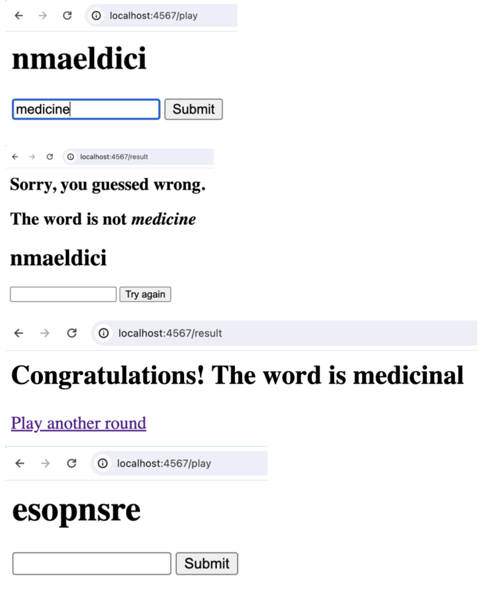

# CHC4010 DevOps Week 6 Practical: Package Management
## Part I. Drawing with turtle-logo
1. Create a new project in IntelliJ with Maven build and add turtle-logo to project dependencies.
2. Read the documentation of turtle-logo. Add the sample program to your project and run it.
3. Initialize a new AnimatedTurtle and draw an equilateral triangle with it:

4. Draw a 5-pointed star or a pentagram.

## Part II. Jumble as a web app
1. Download the java program `Jumble` and run it. Understand how this game is played.
2. Create a new project in IntelliJ with Maven build. Add [spark-core](https://central.sonatype.com/artifact/com.sparkjava/spark-core) and [spark-template-freemarker](https://central.sonatype.com/artifact/com.sparkjava/spark-template-freemarker) to project dependencies.
3. Replicate the Jumble game in a web interface.
  

[^1]
[^1]: Resources:
  https://github.com/perwendel/spark
  https://www.baeldung.com/freemarker-operations
  https://www.vogella.com/tutorials/FreeMarker/article.html
